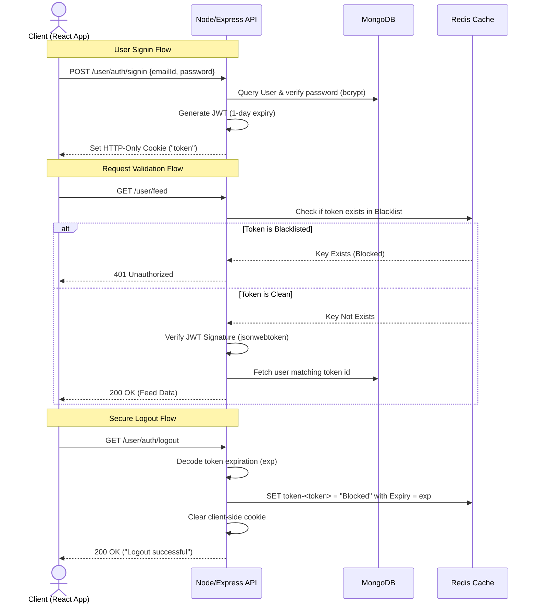

# Developers Adda (dev-meet-up API) 🚀

A robust, high-performance, and secure backend server built for **Developers Adda**—a professional networking platform designed specifically for developers to discover, connect, and collaborate.

This project is built using the **MERN (MongoDB, Express, React, Node.js) stack** combined with **Redis** to implement advanced authentication, request optimization, and scalable routing.

---

## 🏗️ Architecture & Core Flows

### 🔐 Stateless Authentication with Redis Blacklist

To maximize security, this backend implements **JSON Web Token (JWT) authentication** delivered via secure **HTTP-Only cookies**. To mitigate the risk of stolen tokens, we use a high-performance **Redis-based blacklist** to handle stateless logout token invalidation.



---

## 🛠️ Tech Stack & Skills Highlighted

Here are the primary technologies and tools used to build this API, demonstrating hands-on expertise in backend engineering:

| Technology | Purpose & Implementation Details |
| :--- | :--- |
| **Node.js & Express.js** | Used modern **ES Modules (ES6 imports)** to write clean, modular, and maintainable controllers, routes, and middleware. |
| **MongoDB & Mongoose** | Managed database modeling, validation, and advanced aggregation queries (filtering connections, active requests, and self-profiles). |
| **Redis** | Leveraged for fast, in-memory key-value lookups to blacklist logged-out JWTs. Implemented **TTL (Time-To-Live)** keys matching the token's lifetime for automated memory cleanup. |
| **JSON Web Tokens (JWT)** | Used for secure, stateless user identification and API authorization. |
| **Bcrypt** | Implemented password hashing (10 salt rounds) to guarantee that user credentials are encrypted securely in transit and at rest. |
| **Cookie-Parser** | Configured HTTP-Only cookies with security options (`sameSite: "none"`, `secure: true`) to defend against Cross-Site Scripting (XSS) and CSRF attacks. |
| **Validator** | Validated email formats and enforced strong password patterns directly at the API controller boundary. |
| **CORS** | Configured dynamic origin checking with credential permissions (`Access-Control-Allow-Credentials`) for secure local & production API requests. |

---

## 🌟 Key Features Implemented

### 1. Authentication & Security
*   **Sign-up Validation**: Direct checks on inputs (ensuring strong passwords, email formats, and required fields) before database write.
*   **Secure Sign-in**: Secure password check using `bcrypt.compare`.
*   **Redis Blacklist Logout**: When users log out, their token is immediately blacklisted in Redis matching their JWT token's remaining lifespan, preventing token hijacking.

### 2. Connection & Networking Engine
*   **Send Requests**: Users can send connection requests with statuses like `ignored` or `interested` (`POST /user/request/send/:status/:toUserId`).
*   **Accept/Reject Handler**: Review incoming connection requests and update statuses to `accepted` or `rejected` (`POST /user/request/receive/:status/:requestedId`).
*   **Connection & Request Lists**: Endpoints to list accepted connections (`GET /user/request/connection`) and pending incoming requests (`GET /user/request/recieved`).

### 3. Smart User Feed (`GET /user/feed`)
*   Built a custom MongoDB query that recommends user profiles dynamically.
*   **Filtering Logic**: Excludes profiles of users who are:
    1. Themselves (the logged-in user).
    2. Already connected.
    3. Pending connection requests (both sent and received).
    4. Ignored or rejected.

---

## 📂 Project Structure

```bash
dev-meet-up/
├── src/
│   ├── config/
│   │   ├── db.js             # Mongoose MongoDB connection initializer
│   │   └── redis.js          # Redis Client initializer & connection options
│   ├── controllers/
│   │   ├── authController.js       # Register, Login, & Blacklist-Logout logic
│   │   ├── connectionController.js # Connection request sending/receiving
│   │   ├── feedController.js       # Recommendation feed filter query
│   │   ├── profileController.js    # Profile retrieval and updates
│   │   └── requestController.js    # Incoming request list aggregation
│   ├── middlewares/
│   │   └── authMiddleware.js # Token extraction, Redis check, & JWT verification
│   ├── models/
│   │   ├── userModel.js       # User Schema (names, emails, credentials, skills)
│   │   └── connectionModel.js # Bidirectional connection request schema
│   └── app.js                # App entry point, CORS config, and server starter
├── .env                      # Env config (ignored in Git)
├── package.json              # Backend scripts & dependency config
└── README.md                 # Project Documentation
```

---

## 🚀 Getting Started

### Prerequisites
*   Node.js (v18+ recommended)
*   MongoDB Instance (Local or MongoDB Atlas)
*   Redis Instance (Local or Redis Cloud)

### Installation

1. **Clone the repository:**
   ```bash
   git clone https://github.com/SushilCodePro/dev_meet_up.git
   cd dev-meet-up
   ```

2. **Install dependencies:**
   ```bash
   npm install
   ```

3. **Set up your Environment Variables (`.env`):**
   Create a `.env` file in the root directory:
   ```env
   PORT=3000
   MONGODB_URL=your_mongodb_connection_string
   JWT_SECRET=your_jwt_signing_key
   REDIS_PASS=your_redis_password
   ```

4. **Run the server:**
   *   **Development mode** (with Hot Reloading):
       ```bash
       npm run dev
       ```
   *   **Production mode**:
       ```bash
       npm start
       ```
